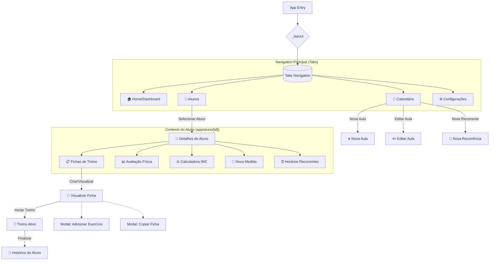

# Mapa do Aplicativo - Personal Trainer "Canivete Suíço"

Este documento descreve a estrutura de navegação e fluxo de telas do aplicativo.

## 🗺️ Fluxograma de Navegação (Mermaid)

## 📂 Estrutura de Diretórios e Rotas (`app/`)

### 1. 🏠 Tabs Principais (`app/(tabs)/`)
*   **`index.tsx`**: Tela inicial (Dashboard). Resumo do dia, próximas aulas.
*   **`alunos.tsx`**: Lista completa de alunos ativos/inativos.
*   **`calendario.tsx`**: Visualização mensal da agenda.
*   **`configuracoes.tsx`**: Configurações globais, backup, etc.

### 2. 👤 Gestão de Alunos (`app/aluno/[id]/`)
Rota dinâmica acessada ao clicar em um aluno na lista.
*   **`fichas.tsx`**: Lista das fichas de treino do aluno.
*   **`avaliacao.tsx`**: Histórico de avaliações físicas.
*   **`imc.tsx`**: Calculadora e registro de IMC.
*   **`nova-medida.tsx`**: Formulário para registrar novas medidas corporais.
*   **`horarios.tsx`**: Configuração de horários fixos (recorrentes) do aluno.

### 3. 📝 Fichas de Treino (`app/ficha/[id]/`)
*   **`visualizar.tsx`**: Detalhes da ficha. Permite adicionar exercícios, editar séries e iniciar o treino.

### 4. 💪 Execução de Treino (`app/treino-ativo/`)
*   **`[fichaId].tsx`**: **Modo "Em Aula"**. Cronômetro, registro de cargas reais, check de séries.

### 5. 📅 Calendário Detalhado (`app/calendario/`)
*   **`nova.tsx`**: Agendamento de aula avulsa.
*   **`nova-recorrente.tsx`**: Configuração de padrão de repetição semanal.
*   **`editar.tsx`**: Alteração de horários ou status da aula (Realizada, Cancelada).

### 6. 📜 Histórico (`app/historico/`)
*   **`[alunoId].tsx`**: Linha do tempo completa dos treinos realizados pelo aluno.

---
**Observações:**
*   O app utiliza **Expo Router**, então a estrutura de pastas reflete diretamente a navegação.
*   Telas modais (como `modal-exercicio.tsx`) são componentes reutilizáveis chamados dentro das telas principais.
